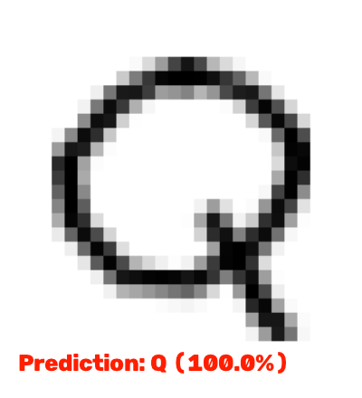

# Handwritten Character Recognition

A CNN that reads handwritten English capital letters (A-Z) from an image — trained, verified, and ready to run.



Handwritten Character Recognition is a small computer-vision pipeline that takes a photo or scan of a single handwritten letter and returns its best guess, with a confidence score, in one command. It does three things in sequence: it preprocesses the input image (blur, grayscale, threshold, resize) into the same 28x28 silhouette format the model was trained on, it runs that through a convolutional neural network trained on the Kaggle A-Z Handwritten Alphabets dataset, and it writes back an annotated copy of the image with the predicted letter overlaid. A pretrained model ships in the repo, so nothing needs to be trained before you can try it.

**Stack:** TensorFlow/Keras · OpenCV · pandas/scikit-learn

**Author:** Anish Kuila

## Table of contents
- [What it does](#what-it-does)
- [Architecture](#architecture)
- [Performance](#performance)
- [Install](#install)
- [Quickstart](#quickstart)
- [Project structure](#project-structure)
- [CLI reference](#cli-reference)
- [Preprocessing pipeline](#preprocessing-pipeline)
- [Limitations](#limitations)

## What it does

```
Image ──▶ [Preprocess: blur → grayscale → threshold → resize 28x28] ──▶ [CNN] ──▶ Predicted letter (A-Z)
                                                                            │
                                                            confidence score + annotated output image
```

Every prediction runs through the same fixed pipeline: an input image is normalized into the dataset's format before the model ever sees it, so a photo taken on a phone gets treated the same way a scanned dataset sample would. The model itself doesn't touch raw pixels — `src/predict.py` owns preprocessing, `src/model.py` owns the network, and `src/train.py` owns fitting it to data. Nothing here guesses at a threshold at inference time that wasn't also used at training time.

## Architecture

| Layer | Technology |
|---|---|
| Model | Custom CNN — 3x Conv2D/MaxPool blocks, 2x Dense, softmax over 26 classes (Keras/TensorFlow) |
| Preprocessing | OpenCV — Gaussian blur, grayscale conversion, inverse binary threshold, resize |
| Data pipeline | pandas, NumPy, scikit-learn — CSV loading, train/test split, one-hot encoding |
| Interface | CLI — `src/train.py`, `src/predict.py` |

```
Conv2D(32, 3x3) -> MaxPool(2x2)
Conv2D(64, 3x3) -> MaxPool(2x2)
Conv2D(128, 3x3) -> MaxPool(2x2)
Flatten
Dense(64, relu)
Dense(128, relu)
Dense(26, softmax)
```

Trained with the Adam optimizer and categorical cross-entropy loss, with learning-rate reduction and early stopping on validation loss.

## Performance

Numbers below are from the bundled model's actual training run, not estimated:

| Metric | Value |
|---|---|
| Classes | 26 (A-Z) |
| Training samples | 50,282, stratified across all 26 letters |
| Validation accuracy | 98.2% |
| Validation loss | 0.080 |
| Model size | 1.7 MB (`.h5`) |
| Input size | 28x28 grayscale |

## Install

Requires Python 3.9+.

```bash
git clone https://github.com/anishneu/handwritten-character-recognition.git
cd handwritten-character-recognition

python -m venv venv
venv\Scripts\activate        # on Windows
source venv/bin/activate     # on macOS/Linux
pip install -r requirements.txt
```

## Quickstart

```bash
# Predict a letter using the bundled pretrained model
python -m src.predict --image samples/letter_Q.png

# Train a new model (see data/README.md for the dataset)
python -m src.train --data data/A_Z_Handwritten_Data.csv --epochs 15
```

`predict.py` prints the predicted letter and confidence, and saves an annotated copy to `outputs/prediction.png`. Add `--show` to also pop up a window with the result.

## Project structure

```
.
├── src/
│   ├── model.py       # CNN architecture and A-Z label mapping
│   ├── dataset.py     # CSV loading and preprocessing for training
│   ├── train.py       # Training script (CLI)
│   └── predict.py     # Inference on a single image (CLI)
├── models/
│   └── model_hand.h5  # Pretrained model, ready to use
├── samples/            # Example letter images to try predictions on
├── data/               # Place the training CSV here (see data/README.md)
└── requirements.txt
```

## CLI reference

| Command | Purpose |
|---|---|
| `python -m src.predict --image <path>` | Run inference on an image; `--model`, `--output`, `--show` are optional |
| `python -m src.train --data <csv>` | Train a model from a dataset CSV; `--epochs`, `--batch-size`, `--output` are optional |

`samples/` has two kinds of examples: `letter_*.png` files pulled straight from the dataset, and `img_*.jpg` files, which are stylized/decorative fonts (a graffiti-style "B", a cursive "Q") — a tougher, out-of-distribution test of how well the model generalizes beyond plain handwriting. The bundled model gets all of them right.

## Preprocessing pipeline

```
Raw image ──▶ Gaussian blur (7x7) ──▶ Grayscale ──▶ Inverse binary threshold ──▶ Resize to 28x28 ──▶ Normalize to [0, 1]
```

The threshold step is what makes an arbitrary photo look like the training data: pixels darker than the cutoff (ink) become white, everything else (background) becomes black, matching the light-stroke-on-dark-background format the dataset ships in. Labels are a fixed `0-25 → A-Z` mapping, one-hot encoded to 26 classes for training.

## Limitations

- Trained on a balanced 50,282-row subsample of the full ~370,000-row dataset, not the entire corpus.
- Only recognizes uppercase Latin letters A-Z — no digits, lowercase, or punctuation.
- No automated test suite.
- CLI only — no web UI or API server.
- The threshold step is tuned for high-contrast images; low-contrast or unevenly lit photos may need a different cutoff in `src/predict.py`.

## License

MIT — see [LICENSE](LICENSE).
